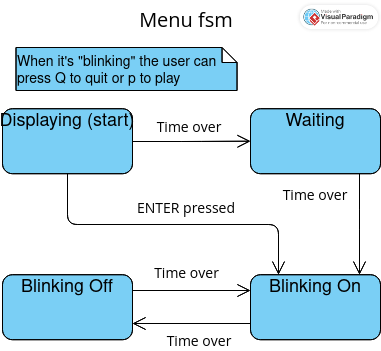
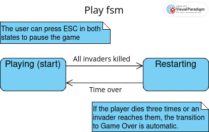
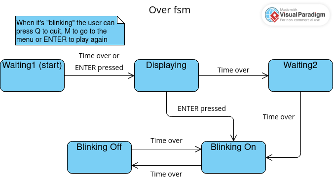

# Space Invaders Clone

This game, as the name suggests, is yet another
[SpaceInvaders](https://en.wikipedia.org/wiki/Space_Invaders)' clone.
Obviously It's not 100% the same as the original one.
But I guarantee it's good enough to be called Space Invaders Clone.

# Build instructions
## Linux (without cmake)

To start, you must install sdl2 and sdl2-mixer (in the future, when I add audio effects).
If you don't know how to install those libraries, here are the commands to install them in debian,
arch and fedora based distros with some extra stuff you need but might not have already installed:

1. `$ sudo apt install make gcc git libsdl2-dev libsdl2-mixer-dev`
2. `$ sudo pacman -S make gcc git sdl2 sdl2_ttf sdl2_mixer`
3. `$ sudo dnf install make gcc git-all SDL2-devel SDL2_mixer-devel`

Using make should produce an executable called space_invaders.out inside the repo root folder
And you're done. You should be able to execute the game now.

## Windows (linux with cmake too)

To be documented...

# Concepts
## Table of Contents

1.  [Finite State Machines (at least two)](#finite-state-machines)
2.  [Event Loop](#event-loop)
3.  Animations
4.  Keyboard and/or Mouse events
5.  Timers
6.  Collisions
7.  Text and Images
8.  [Dynamic collections (at least one)](#dynamic-collections)
9.  [Something else...](#something-else)
10. [Problems](#problems)
11. [The good thing](#the-good-thing)

## Finite State Machines

There's a total of 8 state machines that you can find in the code.
Here's the diagram for each one of them:

### Screens

### Menu

### Play

### Pause

### Game Over


## Event Loop

Here's how I have my event loop:
```
void run_app_loop()
{
    const Uint32 FPS = 60;
    Uint32 start = 0, delta = 0, event_start = 0, event_wait = 1000 / FPS;

    while (screen != SCREEN_EXIT) {
        SDL_Event event;
        if (SDL_WaitEventTimeout(&event, event_wait)) {
            process_app_events(&event);

            const Uint32 event_delta = SDL_GetTicks() - event_start;
            event_start += event_delta;
            // wait less next time
            event_wait -= event_delta < event_wait ? event_delta : event_wait;
        } else {
            update_app(delta);
            render_app();
        
            delta = SDL_GetTicks() - start;
            start += delta;
            // reset event timing
            event_start = start;
            event_wait = 1000 / FPS;
        }
    }
}
```

## Dynamic collections

First of all, a quick shout to [nothings](https://github.com/nothings).
I used two of their libraries: [stb_ds.h](https://github.com/nothings/stb/blob/master/stb_ds.h)
and [stb_image.h](https://github.com/nothings/stb/blob/master/stb_image.h).
Really good pieces of software, btw! Saved me so much hours I can't even count.
There are three dynamic collections in the game: explosions, invaders and shots.

## Something Else...

I was supposed to implement an algorithm, data structure or effect in my game
that would make it more than just an example application implemented using all the concepts required.
I came up with a technique to render texts which basically consisted in rendering ascii characters
using sdl-ttf once and saving the output as a png. Then, as the font picked is ~~almost~~ monospaced,
it became easier to map a character, say 'A', to a section of the image that contains 'A'.
It helped me rendering dynamic ui elements like the score counter.

## Problems

1. I couldn't figure out how to organize my code in a satisfactory way.
It Probably has something to do with either my "it's not good enough" thing or my lack of knowledge on clean coding.
2. Audio effects aren't implemented yet and obviously we got some annoying bugs as well.

## The good thing

Even with a lot of defects, this project helped me improve myself as a programmer and as a person.
I tried so hard in the past to code simple games like pong and snake but failed. Those previous experiences
made me stop thinking of game programming. However, recently I had classes on event-oriented programming with games.
Those classes helped me realize I can't just start coding whatever. I need to have a goal and study on how I can
reach that goal before before kicking the ball. And the bigger the project, the bigger the planning.
